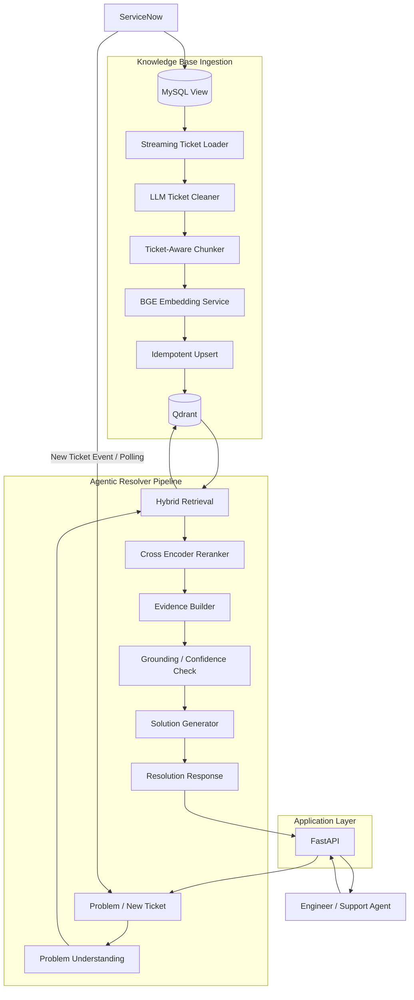
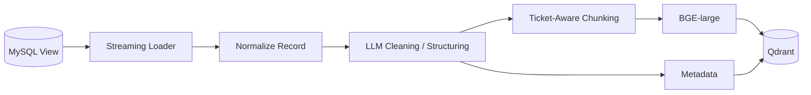
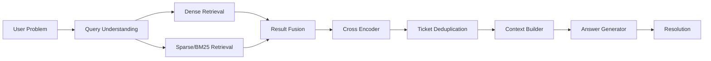
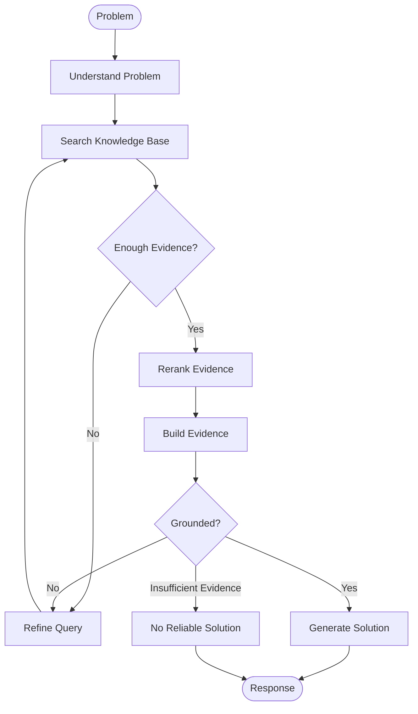
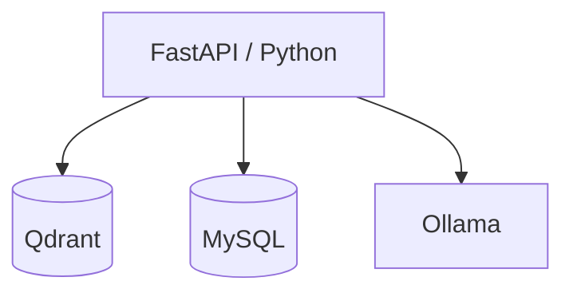
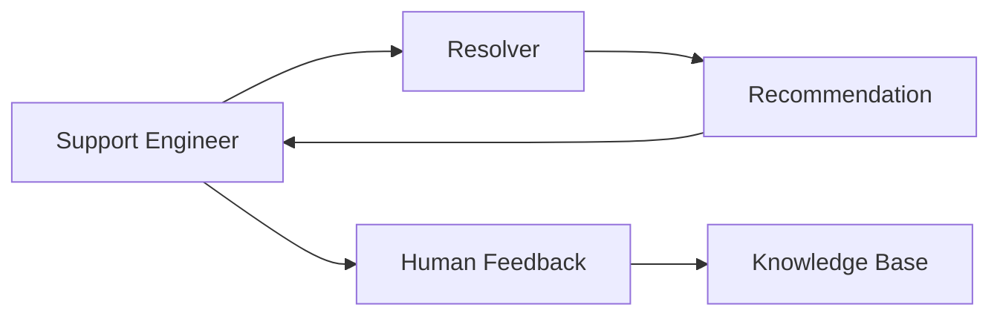
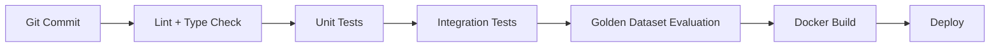

# Advanced RAG — Agentic Ticket Resolver Architecture

## 1. Executive Summary

This project implements a production-oriented **Agentic RAG system for ServiceNow ticket resolution**.

The system has two major components:

### Component 1 — Knowledge Base Ingestion

Solved ServiceNow tickets are continuously transformed into a searchable knowledge base.

```text
ServiceNow
    │
    ▼
MySQL View
    │
    ▼
Ticket Loader
    │
    ▼
LLM Preprocessing
    │
    ▼
Ticket-aware Chunking
    │
    ▼
BGE Embeddings
    │
    ▼
Qdrant
    │
    ▼
Solved Ticket Knowledge Base
```

The knowledge base contains:

* Solved ticket information
* Problem descriptions
* Comments and resolution discussions
* Final resolution
* Next steps
* Ticket metadata
* Original ServiceNow ticket ID

### Component 2 — Resolver Pipeline

Whenever a new problem is received, the system searches the solved-ticket knowledge base and produces a grounded resolution.

```text
New ServiceNow Ticket
        │
        ▼
   Resolver Agent
        │
        ├── Understand Problem
        │
        ├── Retrieve Similar Tickets
        │
        ├── Hybrid Search
        │
        ├── Rerank
        │
        ├── Extract Proven Solutions
        │
        ├── Validate Evidence
        │
        └── Generate Resolution
        │
        ▼
Solution + Next Steps + Relevant Ticket IDs
```

The same resolver is exposed through a REST API:

```http
POST /api/v1/resolve
```

Example:

```json
{
  "problem": "Azure DevOps migration is failing because the custom field cannot be found."
}
```

Response:

```json
{
  "status": "resolved",
  "solution": "Verify that the Custom.SourceWorkItemID field exists...",
  "next_steps": [
    "Verify the target field configuration",
    "Validate the field reference",
    "Retry the migration"
  ],
  "relevant_ticket_ids": [
    "INC0012345",
    "INC0015678"
  ],
  "confidence": 0.91,
  "sources": [
    {
      "ticket_id": "INC0012345",
      "relevance_score": 0.94
    }
  ]
}
```

---

# 2. Goals

## Primary Goals

1. Build a searchable knowledge base from solved ServiceNow tickets.
2. Preserve the relationship between chunks and their original tickets.
3. Retrieve historically relevant tickets for a new problem.
4. Return the proven resolution/next steps from those tickets.
5. Provide ServiceNow ticket IDs as references.
6. Ground generated answers in retrieved evidence.
7. Support both automatic ticket resolution and REST API queries.
8. Support daily batch ingestion.
9. Support near-real-time ingestion for newly solved tickets.
10. Provide observability and evaluation capabilities.
11. Keep embedding, LLM, vector database and reranker components replaceable.

## Non-Goals

The initial version will not:

* Automatically modify ServiceNow tickets.
* Automatically execute remediation commands.
* Automatically change infrastructure.
* Replace human approval for high-impact remediation.
* Use an autonomous agent to perform unrestricted actions.

The first version is a **read-only resolution recommendation system**.

---

# 3. High-Level Architecture



---

# 4. Core Design Principle

The system should be **ticket-centric rather than comment-centric**.

The raw source contains comments, but the unit of knowledge should ultimately be:

```text
Ticket
 ├── Problem
 ├── Symptoms
 ├── Investigation
 ├── Root Cause
 ├── Resolution
 ├── Next Steps
 └── Metadata
```

Individual comments should still be preserved because they provide evidence.

For example:

```text
Ticket INC0012345

Problem:
Migration fails during work item creation.

Investigation:
Target project does not contain Custom.SourceWorkItemID.

Root Cause:
Required custom field was missing.

Resolution:
Create the field and update migration configuration.

Next Steps:
1. Create field
2. Verify reference
3. Retry migration
```

The RAG system should retrieve both:

* the **ticket as a knowledge unit**
* relevant **chunks as evidence**

This is important because returning five unrelated comments from the same ticket is less useful than returning one coherent solved-ticket record.

---

# 5. Knowledge Base Ingestion Architecture

## 5.1 Data Flow



---

# 6. MySQL → Knowledge Base

The existing MySQL loader is appropriate for large-scale ingestion.

The loader should use streaming/chunked reads:

```python
load_view(
    view_name="solved_ticket_view",
    chunk_size=1000
)
```

The pipeline should never load the entire 10M+ comment dataset into memory.

## Required source fields

At minimum:

```text
ticket_id
ticket_state
ticket_type
ticket_created_at
ticket_updated_at
ticket_resolved_at
comment_id
comment_text
comment_created_at
comment_author
priority
category
subcategory
assignment_group
resolution_code
```

Additional fields can be included as available.

---

# 7. Solved Ticket Selection

Only tickets that contain useful resolution information should become knowledge-base entries.

Recommended initial filter:

```text
ticket_state = RESOLVED / CLOSED
AND
resolution information IS NOT NULL
```

Potential future quality filters:

```text
resolution length > minimum threshold
AND
ticket contains meaningful technical information
AND
ticket is not duplicate/spam
```

The ingestion pipeline should record why a ticket was rejected.

Example:

```json
{
  "ticket_id": "INC123",
  "status": "skipped",
  "reason": "No resolution information"
}
```

---

# 8. LLM Preprocessing

The existing `TicketCleaner` should evolve from a simple text cleaner into a **Ticket Knowledge Extractor**.

Instead of only returning:

```text
cleaned_text
```

the preferred output is structured.

Example:

```json
{
  "problem": "...",
  "symptoms": [
    "..."
  ],
  "investigation": [
    "..."
  ],
  "root_cause": "...",
  "resolution": "...",
  "next_steps": [
    "...",
    "..."
  ],
  "technical_entities": [
    "Azure DevOps",
    "Custom.SourceWorkItemID"
  ]
}
```

This gives the retrieval system much better material than simply embedding raw comments.

---

# 9. Important Rule: Do Not Let the LLM Invent Solutions

The preprocessing LLM is allowed to:

* remove noise
* normalize text
* classify information
* summarize existing comments
* extract resolution steps

It must **not invent missing technical information**.

Prompt requirement:

```text
Only extract information explicitly supported by the source ticket.

If a field is not present, return null or an empty list.

Do not infer or invent a root cause or resolution.
```

---

# 10. Chunking Strategy

## Recommended Strategy: Ticket-Aware Semantic + Recursive Chunking

A purely fixed character splitter is not recommended.

Instead:

### Level 1 — Logical sections

First divide the ticket into:

```text
Problem
Symptoms
Investigation
Root Cause
Resolution
Next Steps
```

### Level 2 — Recursive chunking

Large sections are further split using a token-aware recursive splitter.

Recommended initial configuration:

```text
chunk_size: 350–500 tokens
chunk_overlap: 50–75 tokens
```

The exact values should be benchmarked using the golden dataset.

---

# 11. Why Ticket-Aware Chunking?

Consider:

```text
Comment 1:
Migration failed.

Comment 2:
Found that the target field was missing.

Comment 3:
Created the field.

Comment 4:
Migration succeeded.
```

A naive splitter could separate the problem from its resolution.

Ticket-aware chunking can preserve:

```text
Problem → Investigation → Resolution
```

as a coherent knowledge unit.

---

# 12. Recommended Chunk Types

Each chunk should have a `chunk_type`.

Examples:

```text
problem
symptom
investigation
root_cause
resolution
next_steps
conversation
```

This allows retrieval filtering.

For example:

```text
Query:
"How was this migration issue resolved?"

Prefer:
resolution
root_cause
next_steps
```

rather than generic comments.

---

# 13. Chunk ID Design

Chunk IDs must be deterministic.

Recommended:

```text
SHA256(
    ticket_id
    + ":" +
    content_hash
    + ":" +
    chunk_index
)
```

Example:

```text
ticket_id = INC0012345
chunk_index = 2
content_hash = abc123...

chunk_id =
sha256("INC0012345:abc123:2")
```

Benefits:

* deterministic
* collision resistant
* idempotent
* safe for retries
* supports updates

---

# 14. Idempotent Ingestion

The ingestion pipeline must be safe to run repeatedly.

```text
Same ticket
     │
     ▼
Same content
     │
     ▼
Same chunk ID
     │
     ▼
Qdrant upsert
     │
     ▼
No duplicate
```

If the ticket changes:

```text
Ticket updated
      │
      ▼
New content hash
      │
      ▼
New chunk IDs
```

Old chunks should be removed or marked obsolete.

Recommended approach:

```text
ticket_id metadata
        ↓
delete existing chunks for ticket
        ↓
insert current chunks
```

For large-scale optimization, this can later be replaced with versioned chunks.

---

# 15. Qdrant Collection Design

Recommended collection:

```text
service_now_knowledge
```

Vector:

```text
size = 1024
distance = COSINE
```

because:

```text
BAAI/bge-large-en-v1.5
```

produces 1024-dimensional embeddings.

---

# 16. Qdrant Payload Schema

Example:

```json
{
  "ticket_id": "INC0012345",
  "comment_id": "987654",
  "chunk_id": "abc123",
  "chunk_index": 2,

  "chunk_type": "resolution",

  "ticket_state": "Resolved",
  "ticket_type": "Incident",

  "problem": "...",
  "root_cause": "...",
  "resolution": "...",
  "next_steps": [
    "...",
    "..."
  ],

  "text": "...",

  "created_at": "2026-09-01T10:30:00Z",
  "resolved_at": "2026-09-03T14:22:00Z",

  "category": "Migration",
  "subcategory": "Azure DevOps",

  "assignment_group": "Migration Team",

  "embedding_model": "BAAI/bge-large-en-v1.5",

  "knowledge_version": 1
}
```

---

# 17. Qdrant Payload Indexes

Create indexes for frequently filtered fields.

Recommended:

```text
ticket_id
ticket_type
ticket_state
category
subcategory
assignment_group
chunk_type
resolved_at
knowledge_version
```

Do not index every field by default.

---

# 18. Retrieval Architecture

The retrieval pipeline should use multiple stages.



---

# 19. Query Understanding

Before retrieval, the resolver should extract:

```json
{
  "problem": "...",
  "entities": [
    "Azure DevOps",
    "Custom.SourceWorkItemID"
  ],
  "error_messages": [
    "TF51535"
  ],
  "technology": [
    "ADO"
  ],
  "intent": "troubleshooting"
}
```

This query representation can be used for better retrieval.

---

# 20. Dense Retrieval

Use BGE embeddings:

```text
problem
   ↓
BGE embedding
   ↓
1024-dimensional vector
   ↓
Qdrant
```

Initial configuration:

```text
top_k = 50
```

The number should be benchmarked.

---

# 21. Sparse Retrieval

Dense retrieval alone may struggle with:

* error codes
* ticket IDs
* field names
* product names
* configuration keys
* exact technical strings

For example:

```text
TF51535
Custom.SourceWorkItemID
OM4ADO
```

BM25/sparse search is highly valuable here.

Therefore:

```text
Dense Search
+
Sparse Search
```

should be used.

---

# 22. Hybrid Fusion

Initial implementation can use Reciprocal Rank Fusion.

Conceptually:

```text
Dense results
       +
Sparse results
       ↓
RRF
       ↓
Combined ranking
```

This avoids having to directly compare incompatible dense and BM25 scores.

---

# 23. Reranking

After retrieval:

```text
50–100 candidates
       ↓
Cross Encoder
       ↓
Top 10–20
```

Recommended model candidates should be benchmarked rather than hard-coded permanently.

Possible initial candidates:

```text
BAAI/bge-reranker-base
BAAI/bge-reranker-large
```

For the initial production architecture:

```text
Retriever:
BGE-large

Reranker:
BGE-reranker-base
```

can provide a reasonable latency/quality starting point.

The larger reranker can be evaluated later.

---

# 24. Ticket-Level Deduplication

Suppose retrieval produces:

```text
INC001 → 5 chunks
INC002 → 3 chunks
INC003 → 2 chunks
```

The resolver should not treat these as 10 independent tickets.

Instead:

```text
INC001
INC002
INC003
```

should become the primary evidence units.

Within each ticket, the best chunks are assembled.

This produces a better response:

```text
Relevant Tickets:

INC0012345 — 0.94
INC0015678 — 0.89
INC0019988 — 0.82
```

---

# 25. Context Assembly

The LLM should receive a structured context.

Example:

```text
[TICKET INC0012345]

Problem:
...

Root Cause:
...

Resolution:
...

Next Steps:
...

Evidence:
...
```

Then:

```text
[TICKET INC0015678]

Problem:
...

Resolution:
...
```

The context builder should prioritize:

1. Root cause
2. Resolution
3. Next steps
4. Problem
5. Investigation
6. Supporting comments

---

# 26. Context Token Budget

Do not blindly send all retrieved chunks to the LLM.

Initial recommendation:

```text
Retriever:       50
Reranker:        10–20
Final tickets:   3–5
LLM chunks:       5–10
```

The exact numbers should be determined by evaluation.

---

# 27. Agentic Resolver

The resolver should use a controlled state graph rather than a completely autonomous agent.

Recommended flow:



This is where **LangGraph** can be introduced.

---

# 28. Agent State

Example:

```python
class ResolverState(TypedDict):
    query: str
    normalized_query: str
    entities: list[str]

    retrieved_chunks: list[dict]
    reranked_chunks: list[dict]

    relevant_tickets: list[str]

    evidence: list[dict]

    solution: str
    next_steps: list[str]

    confidence: float

    status: str
```

---

# 29. Agent Responsibilities

The resolver agent should perform controlled operations.

### Node 1 — Understand

Extract:

* problem
* entities
* error messages
* technology
* intent

### Node 2 — Retrieve

Perform:

```text
Dense Search
+
Sparse Search
```

### Node 3 — Rerank

Use cross encoder.

### Node 4 — Evidence Builder

Group results by ticket.

### Node 5 — Verification

Check whether enough evidence exists.

### Node 6 — Generate

Generate answer only from evidence.

---

# 30. No-Evidence Behavior

This is extremely important.

If the system does not find a sufficiently similar solved ticket:

```json
{
  "status": "no_reliable_solution",
  "solution": null,
  "next_steps": [],
  "relevant_ticket_ids": [],
  "confidence": 0.31
}
```

The LLM must not hallucinate a solution.

It should say:

```text
No sufficiently similar solved ticket was found in the knowledge base.
```

This is preferable to producing a technically plausible but unsupported solution.

---

# 31. Answer Generation

The generation prompt should enforce grounding.

Example:

```text
You are a ServiceNow ticket resolution assistant.

Your task is to provide a solution using ONLY the supplied
knowledge-base evidence.

Rules:

1. Do not invent a solution.
2. Do not introduce technical steps not supported by the evidence.
3. If the evidence is insufficient, state that clearly.
4. Prefer solutions from tickets with strong relevance.
5. Preserve technical names, error codes and configuration fields.
6. Include the ServiceNow ticket IDs used as evidence.
7. Separate confirmed information from recommendations.
8. Do not claim that a solution is guaranteed to work.

Return:

Problem Understanding
Solution
Next Steps
Relevant Historical Tickets
Confidence
```

---

# 32. API Response Contract

Endpoint:

```http
POST /api/v1/resolve
```

Request:

```json
{
  "problem": "Migration is failing with TF51535 because Custom.SourceWorkItemID cannot be found."
}
```

Response:

```json
{
  "request_id": "req_123456",

  "status": "resolved",

  "problem_understanding": {
    "technology": ["Azure DevOps"],
    "error_codes": ["TF51535"],
    "entities": ["Custom.SourceWorkItemID"]
  },

  "solution": "The historical tickets indicate that the target field configuration should be verified before retrying the migration.",

  "next_steps": [
    "Verify Custom.SourceWorkItemID exists in the target project.",
    "Verify the migration field mapping.",
    "Retry the affected migration."
  ],

  "relevant_ticket_ids": [
    "INC0012345",
    "INC0015678"
  ],

  "confidence": 0.91,

  "sources": [
    {
      "ticket_id": "INC0012345",
      "score": 0.94
    },
    {
      "ticket_id": "INC0015678",
      "score": 0.89
    }
  ]
}
```

---

# 33. API Endpoints

Initial API:

```text
POST /api/v1/resolve
GET  /api/v1/health
GET  /api/v1/ready
```

Optional:

```text
POST /api/v1/resolve/ticket
```

for direct ServiceNow ticket resolution.

Future:

```text
POST /api/v1/feedback
```

to capture whether the recommendation helped.

---

# 34. Automatic New Ticket Resolution

There are two possible approaches.

## Option A — Polling

Simple initial implementation:

```text
Every N minutes
      ↓
Query new ServiceNow tickets
      ↓
Send to Resolver
      ↓
Store recommendation
```

This matches the current preference for simple cron/Python execution.

## Option B — Event Driven

Future:

```text
ServiceNow
    ↓
Webhook/Event
    ↓
Resolver API
    ↓
Agentic RAG
    ↓
Resolution
```

The architecture should support both.

---

# 35. Recommended Initial Approach

Start with:

```text
ServiceNow → MySQL
                  ↓
             Python Poller
                  ↓
            Resolver API
```

Later:

```text
ServiceNow
    ↓
Event/Webhook
    ↓
Resolver API
```

No need to introduce Kafka or another messaging platform initially.

---

# 36. Knowledge Base Freshness

There are actually two different ingestion flows.

## Historical Backfill

```text
Existing solved tickets
        ↓
Large batch
        ↓
Knowledge Base
```

Run once initially.

## Daily Incremental

```text
Newly solved tickets
        ↓
Daily ingestion
        ↓
Knowledge Base
```

## Near Real-Time

When a ticket becomes solved:

```text
Solved Ticket
      ↓
Incremental Ingestion
      ↓
Clean
      ↓
Chunk
      ↓
Embed
      ↓
Qdrant
```

This allows the resolver to use newly discovered solutions quickly.

---

# 37. Configuration

Use environment variables for secrets and deployment-specific values.

Example `.env`:

```env
APP_ENV=development

MYSQL_HOST=localhost
MYSQL_PORT=3306
MYSQL_DATABASE=servicenow
MYSQL_USER=rag_user
MYSQL_PASSWORD=*****

MYSQL_VIEW=solved_ticket_view

QDRANT_HOST=localhost
QDRANT_PORT=6333
QDRANT_COLLECTION=service_now_knowledge

EMBEDDING_PROVIDER=bge
EMBEDDING_MODEL=BAAI/bge-large-en-v1.5

LLM_PROVIDER=ollama
MODEL_NAME=devstral
BASE_URL=http://localhost:11434

RERANKER_MODEL=BAAI/bge-reranker-base

RETRIEVAL_TOP_K=50
RERANK_TOP_K=10
FINAL_TICKET_COUNT=5

CHUNK_SIZE=450
CHUNK_OVERLAP=60

EMBED_BATCH_SIZE=32
MYSQL_BATCH_SIZE=1000

LOG_LEVEL=INFO
```

Secrets must never be committed.

---

# 38. Configuration File

Non-secret configuration can also live in:

```text
config/
    settings.yaml
```

Example:

```yaml
retrieval:
  dense_top_k: 50
  sparse_top_k: 50
  rerank_top_k: 10
  final_ticket_count: 5

chunking:
  chunk_size: 450
  chunk_overlap: 60

embedding:
  model: BAAI/bge-large-en-v1.5
  normalize: true

ingestion:
  mysql_batch_size: 1000
  embedding_batch_size: 32
```

Environment variables should override file configuration.

---

# 39. Failure Handling

Each pipeline stage should be independently recoverable.

```text
MySQL
  ↓
Cleaning
  ↓
Chunking
  ↓
Embedding
  ↓
Qdrant
```

A failure in one stage should not force the entire pipeline to restart.

---

# 40. Retry Policy

Recommended:

```text
Attempt 1
    ↓
wait 2 sec
    ↓
Attempt 2
    ↓
wait 5 sec
    ↓
Attempt 3
    ↓
Dead Letter
```

Use exponential backoff with jitter for remote services.

Retries should apply to:

* MySQL transient failures
* LLM timeout
* embedding failures
* Qdrant network failures

Do not endlessly retry invalid data.

---

# 41. Dead Letter Queue

For the initial version, a full Kafka-based DLQ is unnecessary.

Use a database/file-backed failed-record table.

Example:

```text
ingestion_failures
------------------
id
ticket_id
stage
error
payload
retry_count
created_at
updated_at
status
```

Example:

```text
INC0012345
embedding
CUDA out of memory
3
failed
```

Later this can migrate to a proper queue.

---

# 42. Checkpointing

The ingestion process should maintain progress.

Example:

```text
last_processed_updated_at
```

or:

```text
last_processed_ticket_id
```

Prefer timestamp + ID combination:

```text
(updated_at, ticket_id)
```

This prevents records being skipped when multiple tickets have the same timestamp.

---

# 43. Ingestion Metadata

Maintain an ingestion tracking table:

```text
ticket_ingestion_status
-----------------------
ticket_id
source_updated_at
content_hash
ingestion_status
chunk_count
embedding_model
knowledge_version
last_processed_at
error_message
```

This makes incremental processing deterministic.

---

# 44. Observability

The application should expose metrics such as:

### Ingestion

```text
tickets_processed_total
tickets_failed_total
chunks_created_total
embeddings_created_total
qdrant_upserts_total
ingestion_latency_seconds
```

### Retrieval

```text
queries_total
retrieval_latency_seconds
reranking_latency_seconds
generation_latency_seconds
end_to_end_latency_seconds
```

### Quality

```text
no_solution_rate
low_confidence_rate
average_retrieved_tickets
```

---

# 45. Logging

Use structured JSON logging.

Example:

```json
{
  "timestamp": "2026-09-21T12:00:00Z",
  "level": "INFO",
  "service": "resolver",
  "request_id": "req_123",
  "ticket_id": "INC0012345",
  "stage": "reranking",
  "latency_ms": 142
}
```

Every resolver request should have a `request_id`.

---

# 46. Health Checks

FastAPI:

```text
GET /health
GET /ready
```

Health check:

```text
Application running
```

Readiness check:

```text
MySQL reachable
Qdrant reachable
LLM reachable
Embedding model loaded
```

---

# 47. Deployment Architecture

## Local Development

Docker Compose:



Recommended services:

```yaml
services:

  api:
    build: .
    depends_on:
      - qdrant
      - ollama
      - mysql

  qdrant:
    image: qdrant/qdrant

  mysql:
    image: mysql

  ollama:
    image: ollama/ollama
```

---

# 48. Production Deployment

The architecture should allow:

```text
                Load Balancer
                      │
             ┌────────┴────────┐
             │                 │
          API-1             API-2
             │                 │
             └────────┬────────┘
                      │
                   Qdrant
                      │
                Knowledge Base
```

The resolver API should be stateless.

This allows horizontal scaling.

---

# 49. GPU Architecture

The expensive components are:

```text
BGE-large embedding
Cross encoder
LLM
```

For ingestion:

```text
Embedding workers
       ↓
GPU
```

For query:

```text
Query embedding
      +
Reranker
      +
LLM
```

can share a GPU initially.

At higher scale, separate services:

```text
Embedding Service
Reranker Service
LLM Service
```

---

# 50. Latency Budget

Target:

```text
< 2 seconds
```

A conceptual budget:

| Stage                |      Target |
| -------------------- | ----------: |
| Query preprocessing  |   50–100 ms |
| Embedding            |   50–150 ms |
| Hybrid retrieval     |   50–150 ms |
| Reranking            |  100–300 ms |
| Context construction |      <50 ms |
| LLM generation       | 500–1200 ms |
| Network/overhead     |  100–200 ms |

Total:

```text
~0.9–2.1 seconds
```

The exact target depends heavily on the local LLM and hardware.

Streaming should therefore be enabled for the final answer.

---

# 51. Streaming API

Use Server-Sent Events initially.

```http
POST /api/v1/resolve
Accept: text/event-stream
```

Example:

```text
event: status
data: {"stage":"retrieval"}

event: status
data: {"stage":"reranking"}

event: token
data: {"text":"The"}

event: token
data: {"text":" issue"}

event: token
data: {"text":" appears"}

event: sources
data: {"ticket_ids":["INC0012345"]}

event: complete
data: {"confidence":0.91}
```

---

# 52. Security

The API should implement:

* API authentication
* authorization
* rate limiting
* request size limits
* input validation
* logging
* secrets management

ServiceNow data may contain sensitive enterprise information.

The system should also avoid exposing unrelated ticket information.

---

# 53. Data Isolation

If the system eventually supports multiple organizations/projects:

```text
organization_id
project_id
assignment_group
```

should become metadata.

Retrieval can then enforce:

```text
organization_id = current_user.organization_id
```

This should be implemented before multi-tenant deployment.

---

# 54. Testing Strategy

## Unit Tests

Test independently:

```text
LLM factory
Embedding factory
MySQL loader
Ticket cleaner
Chunker
Qdrant store
Retriever
Reranker
Context builder
Resolver
FastAPI endpoints
```

---

# 55. Integration Test

The primary integration test should be:

```text
MySQL test data
       ↓
Ingestion
       ↓
Qdrant
       ↓
Resolver query
       ↓
Retrieved ticket
       ↓
Generated solution
```

Example assertion:

```python
assert "INC0012345" in response.relevant_ticket_ids
```

and:

```python
assert response.status == "resolved"
```

---

# 56. Golden Dataset

This is one of the most important components of the project.

Create:

```text
golden_dataset.json
```

Example:

```json
[
  {
    "query": "Migration fails with TF51535",
    "expected_ticket_ids": [
      "INC0012345",
      "INC0015678"
    ],
    "expected_resolution": "...",
    "expected_entities": [
      "Custom.SourceWorkItemID"
    ]
  }
]
```

Start with:

```text
50–100 queries
```

Then grow to:

```text
500+
```

---

# 57. Evaluation Metrics

Evaluate retrieval independently from generation.

## Retrieval

Measure:

```text
Recall@K
Precision@K
MRR
NDCG
Hit Rate
```

Example:

```text
Recall@5
MRR@10
NDCG@10
```

## Generation

Evaluate:

```text
Faithfulness
Answer relevance
Citation correctness
Completeness
Hallucination rate
```

---

# 58. Important Evaluation Split

Do not only evaluate:

```text
Query → similar ticket
```

Also evaluate:

```text
Query → correct resolution
```

A ticket may be semantically similar but contain a different solution.

Therefore:

```text
Retrieval Quality
+
Resolution Quality
```

must be measured separately.

---

# 59. Feedback Loop

Future architecture:



Capture:

```text
Was solution useful?
Yes / No

Was suggested ticket relevant?
Yes / No

Did next steps solve issue?
Yes / No

Correct ticket ID?
Yes / No
```

This creates the foundation for continuous evaluation.

---

# 60. Recommended Project Structure

The current structure should evolve toward:

```text
Advanced RAG/
│
├── api/
│   ├── routes/
│   │   ├── resolver.py
│   │   └── health.py
│   └── schemas.py
│
├── config/
│   ├── llm.py
│   ├── settings.py
│   └── settings.yaml
│
├── ingestion/
│   ├── ingestion.py
│   ├── mysql_loader.py
│   ├── preprocessing.py
│   ├── chunking.py
│   ├── embedding.py
│   ├── checkpoint.py
│   └── failures.py
│
├── retrieval/
│   ├── dense.py
│   ├── sparse.py
│   ├── hybrid.py
│   ├── reranker.py
│   └── retriever.py
│
├── resolver/
│   ├── graph.py
│   ├── state.py
│   ├── nodes/
│   │   ├── understand.py
│   │   ├── retrieve.py
│   │   ├── rerank.py
│   │   ├── evidence.py
│   │   ├── verify.py
│   │   └── generate.py
│   └── service.py
│
├── embeddings/
│   ├── base.py
│   ├── bge.py
│   └── factory.py
│
├── vectorstore/
│   └── qdrant.py
│
├── prompts/
│   ├── TicketCleaningPrompt.yaml
│   ├── QueryUnderstandingPrompt.yaml
│   └── AnswerGenerationPrompt.yaml
│
├── evaluation/
│   ├── golden_dataset.json
│   ├── retrieval_eval.py
│   └── generation_eval.py
│
├── tests/
│   ├── unit/
│   └── integration/
│
├── docker/
│   └── docker-compose.yml
│
├── scripts/
│   ├── ingest.py
│   ├── resolve.py
│   └── evaluate.py
│
├── plan.md
├── ARCHITECTURE.md
└── README.md
```

---

# 61. Phased Implementation Plan

## Phase 1 — Finish Knowledge Base

### Step 1

Create:

```text
TicketCleaningPrompt.yaml
```

### Step 2

Change preprocessing from simple cleaning to structured ticket extraction.

### Step 3

Implement:

```text
ingestion/chunking.py
```

### Step 4

Implement Qdrant:

```python
upsert()
delete_by_ticket()
```

### Step 5

Implement embedding batching.

### Step 6

Complete:

```text
MySQL
→ Clean
→ Chunk
→ Embed
→ Qdrant
```

At the end of Phase 1:

```text
Solved ServiceNow tickets
        ↓
Searchable Qdrant KB
```

---

# 62. Phase 2 — Dense Retrieval

Implement:

```text
Query
 ↓
BGE embedding
 ↓
Qdrant
 ↓
Top-K tickets
```

Build evaluation around:

```text
Recall@K
MRR
```

Do not add too many advanced components before measuring the baseline.

---

# 63. Phase 3 — Reranking

Add:

```text
Dense retrieval
      ↓
Top 50
      ↓
Cross encoder
      ↓
Top 10
```

Measure improvement against Phase 2.

---

# 64. Phase 4 — Hybrid Search

Add:

```text
BM25
+
Dense Search
      ↓
RRF
      ↓
Reranker
```

This is particularly important for:

```text
error codes
field names
ticket IDs
technical terms
```

---

# 65. Phase 5 — Resolver Agent

Implement LangGraph:

```text
Understand
    ↓
Retrieve
    ↓
Rerank
    ↓
Evidence
    ↓
Verify
    ↓
Generate
```

Keep every node independently testable.

---

# 66. Phase 6 — REST API

Implement:

```http
POST /api/v1/resolve
```

Then:

```http
GET /health
GET /ready
```

Add streaming after the basic synchronous API is stable.

---

# 67. Phase 7 — Automatic Ticket Resolution

Implement:

```text
New ServiceNow ticket
        ↓
Polling
        ↓
Resolver
        ↓
Recommendation
```

Initially store the recommendation.

Do not automatically modify the ServiceNow ticket.

---

# 68. Phase 8 — Evaluation and Feedback

Add:

```text
Golden Dataset
Retrieval Evaluation
Generation Evaluation
Human Feedback
```

Then create regression tests.

Every change to:

```text
chunking
embedding
retrieval
reranking
prompt
LLM
```

should be evaluated against the golden dataset.

---

# 69. Phase 9 — Production Hardening

Add:

```text
Authentication
Rate limiting
Structured logging
Metrics
Tracing
Retry
Dead-letter handling
Checkpointing
Health checks
Docker
CI/CD
```

---

# 70. CI/CD

Recommended pipeline:



Deployment should be blocked if critical regression tests fail.

---

# 71. Architecture Decision Records

The project should maintain ADRs for important decisions.

Example:

```text
docs/
└── adr/
    ├── 001-qdrant.md
    ├── 002-bge-embedding.md
    ├── 003-ticket-aware-chunking.md
    ├── 004-hybrid-search.md
    └── 005-langgraph-resolver.md
```

This prevents architecture decisions from being lost.

---

# 72. Open Questions

The following decisions should be validated experimentally rather than assumed.

## Q1 — Chunk Size

Test:

```text
300 tokens
450 tokens
600 tokens
```

with:

```text
50–100 overlap
```

Measure retrieval quality.

---

## Q2 — BGE-large vs BGE-base

Current architecture uses:

```text
BGE-large
```

but the embedding factory should make this configurable.

Benchmark:

```text
BGE-base
vs
BGE-large
```

against the same golden dataset.

---

## Q3 — Reranker

Benchmark:

```text
bge-reranker-base
vs
bge-reranker-large
```

using:

```text
MRR
NDCG
latency
```

---

## Q4 — Sparse Search

Determine whether:

```text
Qdrant native sparse vectors
```

or:

```text
external BM25
```

provides the best operational fit.

The architecture should keep the sparse retriever behind an interface.

---

## Q5 — LLM

The LLM abstraction should support:

```text
Devstral
Gemma
OpenAI
other OpenAI-compatible endpoints
```

without modifying resolver logic.

---

# 73. Critical Architectural Principle

The system should **not become dependent on a specific model**.

Use:

```text
Resolver
    ↓
LLM Interface
    ↓
Devstral / OpenAI / Gemini / etc.
```

and:

```text
Retriever
    ↓
Embedding Interface
    ↓
BGE / OpenAI / Jina / etc.
```

This allows experimentation without rewriting the application.

---

# 74. Final Target Architecture

The final system should look like:

```text
                     ┌───────────────────────────┐
                     │       ServiceNow          │
                     └─────────────┬─────────────┘
                                   │
                     ┌─────────────▼─────────────┐
                     │         MySQL View        │
                     └─────────────┬─────────────┘
                                   │
                         ┌─────────▼─────────┐
                         │ Streaming Loader  │
                         └─────────┬─────────┘
                                   │
                         ┌─────────▼─────────┐
                         │ Ticket Knowledge  │
                         │    Extraction     │
                         └─────────┬─────────┘
                                   │
                         ┌─────────▼─────────┐
                         │ Ticket-Aware      │
                         │ Chunking          │
                         └─────────┬─────────┘
                                   │
                         ┌─────────▼─────────┐
                         │ BGE Embeddings    │
                         └─────────┬─────────┘
                                   │
                         ┌─────────▼─────────┐
                         │      Qdrant       │
                         │ Solved Ticket KB  │
                         └─────────┬─────────┘
                                   │
              ┌────────────────────┴───────────────────┐
              │                                        │
              │          RESOLVER PIPELINE             │
              │                                        │
              │  Problem                                │
              │    ↓                                   │
              │  Understand                            │
              │    ↓                                   │
              │  Dense + Sparse Search                 │
              │    ↓                                   │
              │  Hybrid Fusion                         │
              │    ↓                                   │
              │  Cross Encoder                         │
              │    ↓                                   │
              │  Ticket Deduplication                  │
              │    ↓                                   │
              │  Evidence Builder                      │
              │    ↓                                   │
              │  Grounding Check                       │
              │    ↓                                   │
              │  LLM Solution Generation               │
              │    ↓                                   │
              │  Solution + Next Steps + Ticket IDs    │
              │                                        │
              └────────────────────┬───────────────────┘
                                   │
                     ┌─────────────▼─────────────┐
                     │        FastAPI            │
                     │ POST /api/v1/resolve      │
                     └─────────────┬─────────────┘
                                   │
                         ┌─────────▼─────────┐
                         │ Support Engineer  │
                         └───────────────────┘
```

---

# 75. Definition of Done

The project can be considered a working MVP when the following flow works end-to-end:

```text
100+ solved ServiceNow tickets
        ↓
MySQL
        ↓
Ingestion
        ↓
LLM cleaning
        ↓
Ticket-aware chunks
        ↓
BGE embeddings
        ↓
Qdrant
        ↓
POST /api/v1/resolve
        ↓
Hybrid retrieval
        ↓
Reranking
        ↓
Relevant solved tickets
        ↓
Grounded solution
        ↓
Next Steps
        ↓
ServiceNow Ticket IDs
```

Example:

```text
User:
"Migration fails with TF51535 because
Custom.SourceWorkItemID cannot be found."

Resolver:

Relevant tickets:
INC0012345
INC0015678

Solution:
Historical solved tickets indicate that the target
Custom.SourceWorkItemID field must exist before the
migration operation is executed.

Next Steps:
1. Verify the field exists.
2. Verify the migration mapping.
3. Retry the migration.

Evidence:
INC0012345
INC0015678

Confidence:
0.91
```

The critical property is:

> **Every generated resolution must be traceable back to one or more solved ServiceNow tickets in the knowledge base.**

That makes the system useful not merely as a generic chatbot, but as an **enterprise ticket-resolution system grounded in the organization's own historical support knowledge**.
